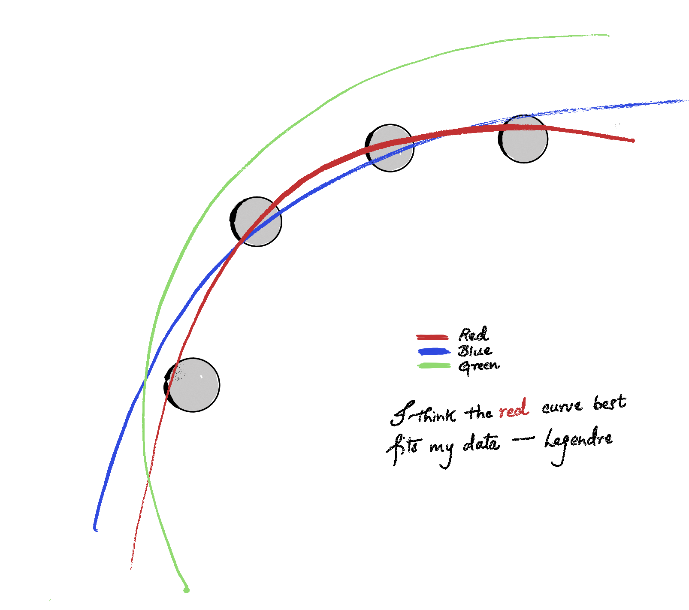
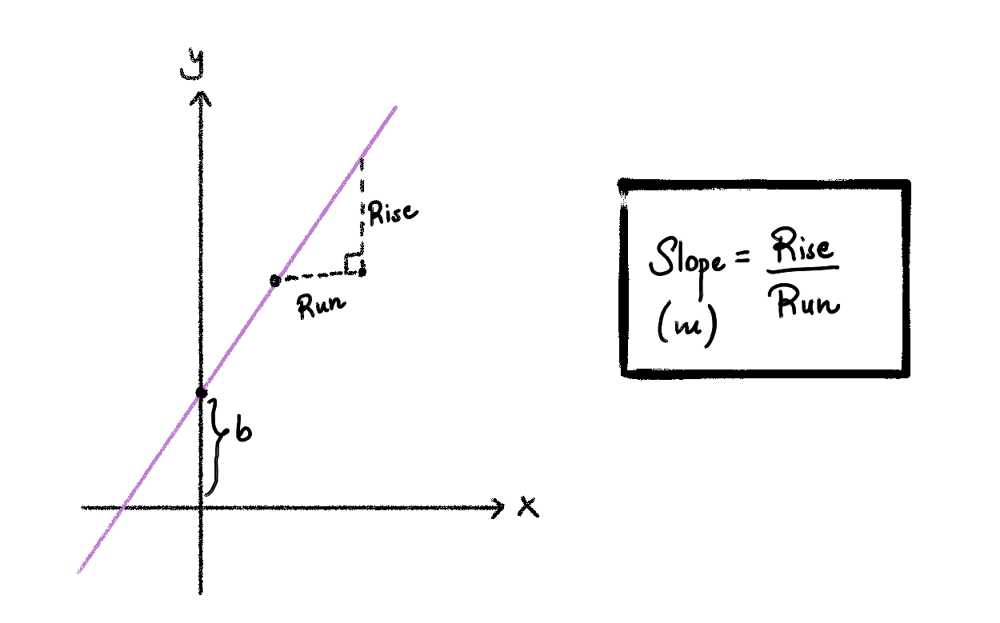
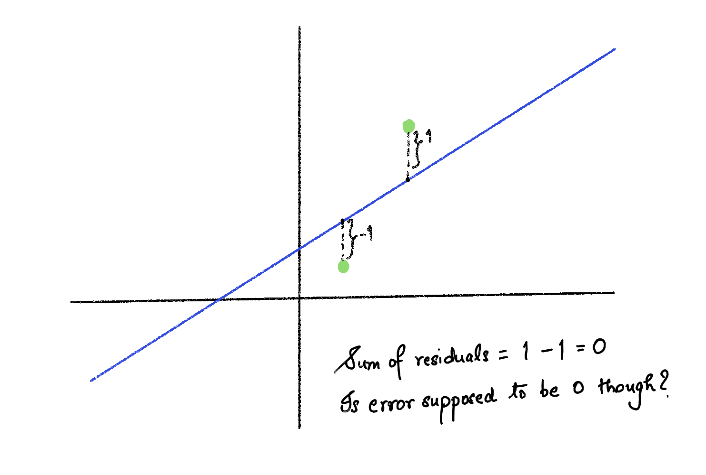

<style>
.quarto-figure-center figcaption {
  text-align: center;
}

.quarto-figure-center {
  text-align: center;
}

.quarto-figure-center > figure {
  margin: 0 auto;
  display: block;
}

.js-plotly-plot {
  margin: 0 auto;
}
</style>

## Some half-baked history

The story begins with making predictions---in prehistoric times they were based on omens, oracles,
and divine indication, but the practice of making mathematically sound predictions based on data started with 
the astronomers of the 18th and 19th centuries who were trying to predict the orbital path of celestial objects. 
The French mathematician Adrien-Marie Legendre is credited with having first published the formal description of the method of
least squares in 1805, as an appendix to his work on the orbits of comets. He was working on a curve-fitting problem---
given a set of observations of a comet's position across several nights, find the parameters for a parabolic path
that best fits all the data simultaneously (see @fig-orbit ).

{#fig-orbit width=50% fig-align="center"}

Since the measurements are noisy and there might not exist a single parabola passing through
all the data points simultaneously, Legendre sought to minimize the errors instead:
$$\text{minimize } \epsilon_1^2 + \epsilon_2^2 + \cdots ,$$
where $\epsilon_i$ is the error---also called residual---between the observed and predicted
position. Why square the residuals? Well, residuals can be both positive and negative, and
you don't want them to cancel each other out. Squaring makes everything positive, yielding 
a non-negative of the errors. There is a deeper reason than merely measuring positive
residuals--namely, the total error (loss) becomes a differentiable function, whose minima
can be calculated easily. And there is an even deeper reason from statistics --à la Gauss--
which we won't go into. 

## Linear Regression

I cannot define regression better than the Merriam-Webster---a functional relationship 
between two or more correlated variables that is often empirically determined from 
data and is used especially to predict values of one variable when given values of the others.
So when we just add the adjective "linear" and voilà, we get linear regression. A function is linear 
if it is formed by sums of input variables multiplied by constants.
For example, $f(x) = 2x$ is linear in $x$. For a multi-variable example take $f(x, y) = 5x + 3y$.
A function like $f(x)= 3x^2 + 2$ would not be linear (it is quadratic because of the square term).

Let's consider the "tips" dataset from seaborn. In @fig-tips we plot the tip amount against
the total bill for the rows in the "tips" dataset. In mathematical terminology, total bill
would be called the input and tip amount would be called the output. In statistical and machine learning
terminology, total bill would be the predictor/independent variable/explanatory variable/covariate/feature
while the tip amount be called the response/dependent variable/outcome/target.


```{python}
#| label: fig-tips
#| fig-cap: "Tip amount vs. Total Bill."
#| fig-align: center
#| cache: true

import seaborn as sns
import matplotlib.pyplot as plt

df = sns.load_dataset("tips")

plt.figure(figsize=(7, 5))
plt.scatter(df["total_bill"], df["tip"], alpha=0.6, color="steelblue")
plt.xticks(range(0,51,10))
plt.xlabel("Total Bill ($)")
plt.ylabel("Tip ($)")
plt.title("Total Bill vs Tip")
plt.show()
```

In this example, the goal of linear regression is to draw a line that best fits the data
in the scatter plot. From @fig-tips we see that the line should be positive sloped (increasing).
In fact, we expect the tips to be roughly proportional to the total bill (higher bills have higher tips,
while lower bills have lower tips). But there are outliers, and this is also expected from our 
experiences--Statistics does not aim for a perfect relationship. To say it more mathematically,
it is mathematically impossible for a single line to pass through all the data points. And hence,
we are in the situation of Legendre, we restate the goal--we want to minimize the errors.

To formalize the problem, first let's define the family of lines that we could use to fit this
data. We know from high-school algebra, that the equation of a line in the plane is given by
$y = mx + b$, where $m$ is the slope of the line and $b$ is the y-intercept/vertical intercept (see @fig-slope
for the illustration of the equation of a line.)

{#fig-slope width=60% fig-align="center"}


For the scatter plot from the tips dataset, we can fit various lines in the plane. In @fig-interactive you can experiment
with various values of $m$ and $b$ to find lines that fit the data.

```{python}
#| label: fig-interactive
#| fig-cap: "Interactive line with slope and intercept sliders"
#| fig-align: center

import plotly.io as pio
pio.renderers.default = "notebook"

import plotly.graph_objects as go
import numpy as np
import seaborn as sns

df = sns.load_dataset("tips")
x = np.linspace(df["total_bill"].min(), df["total_bill"].max(), 100)

m_values = np.arange(0.0, 0.35, 0.05)
b_values = np.arange(-0.5, 3.0, 0.5)
n_m, n_b = len(m_values), len(b_values)

scatter = go.Scatter(
    x=df["total_bill"], y=df["tip"],
    mode="markers",
    marker=dict(color="steelblue", opacity=0.5),
    name="Data"
)

m_traces = [
    go.Scatter(x=x, y=m * x + 0.5, mode="lines",
               line=dict(color="red", width=2),
               visible=(i == 0),
               name=f"m={m:.2f}")
    for i, m in enumerate(m_values)
]

b_traces = [
    go.Scatter(x=x, y=0.15 * x + b, mode="lines",
               line=dict(color="green", width=2),
               visible=False,
               name=f"b={b:.1f}")
    for j, b in enumerate(b_values)
]

all_traces = [scatter] + m_traces + b_traces

# m slider: show m_traces[i], hide all b_traces
m_steps = []
for i in range(n_m):
    vis = [True]                              
    vis += [j == i for j in range(n_m)]      
    vis += [False] * n_b                      
    m_steps.append(dict(
        method="restyle",
        args=[{"visible": vis}],
        label=f"{m_values[i]:.2f}"
    ))

# b slider: show b_traces[j], hide all m_traces
b_steps = []
for j in range(n_b):
    vis = [True]                              # scatter always visible
    vis += [False] * n_m                      # all m_traces hidden
    vis += [k == j for k in range(n_b)]       # only b_trace[j] visible
    b_steps.append(dict(
        method="restyle",
        args=[{"visible": vis}],
        label=f"{b_values[j]:.1f}"
    ))

sliders = [
    dict(
        active=0,
        currentvalue={"prefix": "Slope (m): ", "xanchor": "left"},
        pad={"t": 30, "b": 10},
        steps=m_steps,
        x=0, y=0, len=1.0    # negative y = below plot
    ),
    dict(
        active=0,
        currentvalue={"prefix": "Intercept (b): ", "xanchor": "left"},
        pad={"t": 30, "b": 10},
        steps=b_steps,
        x=0, y=-0.4, len=1.0    # further below
    )
]

fig = go.Figure(data=all_traces)
fig.update_layout(
    autosize=True,
    width=600,
    height=550,          
    sliders=sliders,
    title="Total Bill vs Tip",
    xaxis_title="Total Bill ($)",
    yaxis_title="Tip ($)",
    margin=dict(t=50, b=200, l=50, r=50)   
)

fig.show()
```

Let $(x_1,y_1), (x_2,y_2), \cdots (x_n,y_n)$ be data points. Let $y= mx + b$ be an arbitrary line. For a given x, we denote
the linear regression prediction by $\hat{y}:= mx + b$. The residual (error) for a given point $(x_i, y_i)$ is
$y_i - \hat{y}_i = y_i - (mx_i + b)$. It is the vertical distance from the point to the line.

Now we want a single overall measure accounting for all the residuals. Adding the residuals to get the overall error does not work, because some residuals are positive
while others are negative, and we don't want errors to cancel out. For instance, look at @fig-cancel.

{#fig-cancel width=60% fig-align="center"}

Instead of adding up the residual we add up the squares of the residuals. We call this sum SSR,
short for sum of squares of residuals. Note that SSR is 0 if and only if the best fit line passes through all the data points.
SSR is large if the residuals are large on average, and SSR is small if the residuals are small on average. We have

$$\text{SSR} = (y_1 - (mx_1 + b))^2 + (y_2 - (mx_2 + b))^2 + (y_3 - (mx_3 + b))^2 + \cdots, $$

our goal is: $$ \text{Find the best m and b to minimize } SSR$$ 


So now we have a formalized goal---we want to find the line that minimizes the SSR. This line is called the best-fit line. In
@fig-residuals you can tinker with the $m$ and the $b$ values to find a line that minimizes the SSR. 

```{python}
#| label: fig-residuals
#| fig-cap: "Residuals and sum of squared residuals"
#| fig-align: center

import plotly.io as pio
pio.renderers.default = "notebook"

import plotly.graph_objects as go
import numpy as np

# 4 fixed points
x_pts = np.array([1, 2, 3, 4])
y_pts = np.array([1.5, 2.5, 2.0, 3.5])
labels = ["(x₁,y₁)", "(x₂,y₂)", "(x₃,y₃)", "(x₄,y₄)"]

x_line = np.linspace(0, 5, 100)

m_values = np.round(np.arange(0.0, 1.1, 0.1), 2)
b_values = np.round(np.arange(-1.0, 3.25, 0.25), 2)
n_m, n_b = len(m_values), len(b_values)

fixed_b = 0.5   # b held fixed when m slider moves
fixed_m = 0.5   # m held fixed when b slider moves

def compute_ssr(m, b):
    return np.sum((y_pts - (m * x_pts + b))**2)

def residual_trace(m, b):
    xs, ys = [], []
    for xi, yi in zip(x_pts, y_pts):
        xs += [xi, xi, None]
        ys += [yi, m * xi + b, None]
    return go.Scatter(x=xs, y=ys, mode="lines",
                      line=dict(color="orange", width=2, dash="dash"),
                      showlegend=False, visible=False)

def ssr_annotation(m, b):
    ssr = compute_ssr(m, b)
    return dict(
        x=0.02, y=0.95, xref="paper", yref="paper",
        text=f"<b>SSR = Σ(yᵢ - ŷᵢ)² = {ssr:.3f}</b>",
        showarrow=False,
        font=dict(size=13),
        bgcolor="rgba(255,255,200,0.8)",
        bordercolor="orange",
        borderwidth=1
    )

# Traces
scatter = go.Scatter(
    x=x_pts, y=y_pts,
    mode="markers+text",
    text=labels,
    textposition="top center",
    marker=dict(color="steelblue", size=12),
    showlegend=False
)

# m slider traces (b fixed)
m_line_traces = [
    go.Scatter(x=x_line, y=m * x_line + fixed_b, mode="lines",
               line=dict(color="red", width=2),
               visible=(i == 0), showlegend=False)
    for i, m in enumerate(m_values)
]
m_res_traces = [residual_trace(m, fixed_b) for m in m_values]
m_res_traces[0].visible = True

# b slider traces (m fixed)
b_line_traces = [
    go.Scatter(x=x_line, y=fixed_m * x_line + b, mode="lines",
               line=dict(color="red", width=2),
               visible=False, showlegend=False)
    for b in b_values
]
b_res_traces = [residual_trace(fixed_m, b) for b in b_values]

all_traces = [scatter] + m_line_traces + m_res_traces + b_line_traces + b_res_traces

# m slider steps
m_steps = []
for i, m in enumerate(m_values):
    vis = ([True]
           + [j == i for j in range(n_m)]
           + [j == i for j in range(n_m)]
           + [False] * n_b
           + [False] * n_b)
    m_steps.append(dict(
        method="update",
        args=[{"visible": vis}, {"annotations": [ssr_annotation(m, fixed_b)]}],
        label=f"{m:.1f}"
    ))

# b slider steps
b_steps = []
for j, b in enumerate(b_values):
    vis = ([True]
           + [False] * n_m
           + [False] * n_m
           + [k == j for k in range(n_b)]
           + [k == j for k in range(n_b)])
    b_steps.append(dict(
        method="update",
        args=[{"visible": vis}, {"annotations": [ssr_annotation(fixed_m, b)]}],
        label=f"{b:.2f}"
    ))

sliders = [
    dict(active=0,
         currentvalue={"prefix": "Slope (m): ", "xanchor": "left"},
         pad={"t": 30, "b": 10},
         steps=m_steps, x=0, y=0, len=1.0),
    dict(active=0,
         currentvalue={"prefix": "Intercept (b): ", "xanchor": "left"},
         pad={"t": 30, "b": 10},
         steps=b_steps, x=0, y=-0.45, len=1.0)
]

fig = go.Figure(data=all_traces)
fig.update_layout(
    sliders=sliders,
    annotations=[ssr_annotation(m_values[0], fixed_b)],
    title="Residuals and Sum of Squared Residuals",
    xaxis_title="x",
    yaxis_title="y",
    autosize=True,
    height=550,
    width=600,
    margin=dict(t=50, b=200, l=50, r=50)
)

fig.show()
```

After tinkering for a while, you realize, "Hey! There should be a mathematical way to find the best $m$ and $b$, right?".
And there is! You can try it:

:::{.callout-tip}
## Exercise
Let $(x_1,y_1), (x_2,y_2), \cdots, (x_n,y_n)$ be the data points. The best $m^*$ and $b^*$ that minimize SSR are given by

$$m^* = \frac{(x_1 - \bar{x})(y_1 - \bar{y}) + (x_2 - \bar{x})(y_2 - \bar{y}) + \cdots + (x_n - \bar{x})(y_n - \bar{y})}{(x_1 - \bar{x})^2 + (x_2 - \bar{x})^2 + \cdots + (x_n - \bar{x})^2}$$

$$b^* = \bar{y} - m^* \bar{x}$$

where $\bar{x} = \frac{x_1+x_2+\cdots+x_n}{n}$ and $\bar{y} = \frac{y_1+y_2+\cdots+y_n}{n}$.

Trust me. You just need algebra for this.

Note that $b^*$ ensures the best-fit line always passes through the point $(\bar{x}, \bar{y})$.

If you know covariance and variance, $m^*$ is simply $\frac{\text{Cov}(x,y)}{\text{Var}(x)}$.
:::

In Python there are libaries that find the best-fit line for us. We will get into it soon, but before that just a little
bit more theory.


## Measuring the goodness of fit (R- squared)

For a given set of data points, we know how to find the best-fit line (linear regression), and now we want
a single number that tells us how well the model fits this data. 

:::{.callout-tip}
## Question
But didn't the SSR already do that? High SSR is bad and small SSR is good?
Not quite.  
If I tell you SSR = 50, you don't know if that's a great fit or a terrible one. It depends entirely on 
the scale of your data. If your 
target values are in the range [0, 1], that's catastrophic. If they're in the millions, it's essentially perfect.
:::

The $R^2$ measure we discuss below gives us a normalized measure of how good a linear regression model
fits the data, in other words, how much of the variance is accounted for by the linear regression model.

To derive $R^2$, we will compare two models---a base model which is just a constant (null model) and our regression
model. $R^2$ essentially measures how much of an improvement the linear regression model makes over the null model.
Given data points $y_1, y_2, \cdots y_n$ (we are taking the target values), the expected value (average) of the y values is
$$ \bar{y} = \frac{y_1 + y_2 + \cdots y_n}{n}.$$ The null model's prediction for any arbitrary input x is just $\bar{y}$.
In other words, we are saying, "We are not going to claim any relation between the dependent variable and the independent
variable". Irrespective of the input, we make the constant prediction: $\bar{y}$. On the other hand, for the linear regression
model, we will use a best-fit line to model our data. See @fig-residuals-null for a comparison of the residuals for
the null model and the linear regression models (tips dataset).

```{python}
#| label: fig-residuals-null
#| fig-cap: "Residuals and sum of squared residuals"
#| fig-align: center

import plotly.graph_objects as go
import pandas as pd
import numpy as np
from sklearn.linear_model import LinearRegression
import seaborn as sns

tips = sns.load_dataset("tips")
x = tips["total_bill"].values.reshape(-1, 1)
y = tips["tip"].values

reg = LinearRegression().fit(x, y)
y_hat = reg.predict(x)
y_bar = y.mean()

fig = go.Figure()

# scatter points
fig.add_trace(go.Scatter(x=tips["total_bill"], y=y, mode="markers",
    name="Data", marker=dict(color="steelblue", opacity=0.6)))

# null model line
fig.add_trace(go.Scatter(x=[tips["total_bill"].min(), tips["total_bill"].max()],
    y=[y_bar, y_bar], mode="lines", name="Null model (ȳ)",
    line=dict(color="gray", dash="dash")))

# regression line
fig.add_trace(go.Scatter(x=tips["total_bill"], y=y_hat, mode="lines",
    name="Regression line", line=dict(color="firebrick")))

# null residuals
null_resid_traces = []
for xi, yi in zip(tips["total_bill"], y):
    null_resid_traces.append(go.Scatter(
        x=[xi, xi], y=[yi, y_bar], mode="lines",
        line=dict(color="gray", width=1), showlegend=False))

# regression residuals
reg_resid_traces = []
for xi, yi, yhi in zip(tips["total_bill"], y, y_hat):
    reg_resid_traces.append(go.Scatter(
        x=[xi, xi], y=[yi, yhi], mode="lines",
        line=dict(color="firebrick", width=1), showlegend=False))

for t in null_resid_traces + reg_resid_traces:
    fig.add_trace(t)

n_base = 3  # scatter + null line + reg line
n_null = len(null_resid_traces)
n_reg  = len(reg_resid_traces)

def visibility(show_null, show_reg):
    base = [True] * n_base
    null = [show_null] * n_null
    reg  = [show_reg]  * n_reg
    return base + null + reg

fig.update_layout(
    updatemenus=[dict(
        type="buttons", direction="right", x=0.5, xanchor="center", y=1.12,
        buttons=[
            dict(label="No residuals",
                 method="restyle",
                 args=[{"visible": visibility(False, False)}]),
            dict(label="Null residuals (SST)",
                 method="restyle",
                 args=[{"visible": visibility(True, False)}]),
            dict(label="Regression residuals (SSR)",
                 method="restyle",
                 args=[{"visible": visibility(False, True)}]),
            dict(label="Both",
                 method="restyle",
                 args=[{"visible": visibility(True, True)}]),
        ]
    )],
    title="Null model vs. regression model residuals",
    xaxis_title="Total bill ($)",
    yaxis_title="Tip ($)",
    legend=dict(x=0.01, y=0.99),
    width=750,   
    height=500,
)

fig.show()
```

For the null model, we will call the sum of the squares of the residuals SST (total sum of squares). We have
$$ \text{SST} = \sum_{i=1}^{n} (y_i - \bar{y})^2 $$

For the linear regression model, we have
$$ \text{SSR} = \sum_{i=1}^{n} (y_i - \hat{y}_i)^2 $$
where $\hat{y}_i$ is $m^*x_i + b^*$: the prediction for $x_i$ from the best-fit line.

Now consider the difference:
$$ \text{SST} - \text{SSR}$$

Well, why not just take this absolute difference as our measure?
There are a few reasons for this
- This is scale/unit dependent. For instance, if I use cents instead of dollars,
$\text{SST} - \text{SSR}$ will be 10000 times the one I get for dollars.
- We cannot interpret the difference easily--- What does $\text{SST} - \text{SSR} = 20$ mean?

Instead we want: what fraction of SST the regression model accounts for. Also, $R^2$ fixes both the above issues.
Hence, we have 

$$ 
\begin{align}
R^2 &= \frac{\text{SST} - \text{SSR}}{\text{SST}}\\
&= 1 - \frac{\text{SSR}}{\text{SST}}
\end{align}
$$

Note that $R^2$ is a value in $(-\infty,1]$. A value of 0 means the 
regression model is no better than the null model. It means SSR = SST, i.e. the regression explains none of the variance. 
A value of 1 means that the best-fit line passes through
all the data points.

We can see some examples of the different $R^2$ values in @fig-r-squared.
```{python}
#| label: fig-r-squared
#| fig-cap: "Effect of noise on R squared"
#| fig-align: center

import plotly.graph_objects as go
import numpy as np

np.random.seed(42)
n = 80
x = np.linspace(0, 10, n)
slope, intercept = 2.0, 1.0
y_true = slope * x + intercept

noise_levels = np.round(np.linspace(0.5, 15, 20), 2)

frames_data = []
for noise in noise_levels:
    y = y_true + np.random.normal(0, noise, n)
    y_bar = y.mean()
    coeffs = np.polyfit(x, y, 1)
    y_hat = np.polyval(coeffs, x)
    sst = np.sum((y - y_bar) ** 2)
    ssr = np.sum((y - y_hat) ** 2)
    r2 = max(0.0, 1 - ssr / sst)
    frames_data.append((y, y_hat, r2, noise))

y0, y_hat0, r2_0, noise0 = frames_data[0]

fig = go.Figure()

fig.add_trace(go.Scatter(x=x, y=y0, mode="markers",
    marker=dict(color="steelblue", opacity=0.6), name="Data"))

fig.add_trace(go.Scatter(x=x, y=y_hat0, mode="lines",
    line=dict(color="firebrick", width=2), name="Best-fit line"))

fig.add_trace(go.Scatter(
    x=[8], y=[115],
    mode="text",
    text=[f"R² = {r2_0:.3f}"],
    textfont=dict(size=20, color="black"),
    showlegend=False,
    name="r2_label"
))

steps = []
for i, (y, y_hat, r2, noise) in enumerate(frames_data):
    step = dict(
        method="update",
        label=str(noise),
        args=[
            {"y": [y, y_hat, [115]]},          
            {"x": [x, x, [8]]},                 
            # update text on the third trace only
        ]
    )
    step["args"][0]["y"] = [y, y_hat, [115]]
    step["args"][0]["text"] = [None, None, [f"R² = {r2:.3f}"]]
    steps.append(step)

fig.update_layout(
    width=600,   
    height=550,  
    margin=dict(b=150), 
    sliders=[dict(
        active=0,
        currentvalue={"prefix": "Noise σ: "},
        pad={"t": 50}, 
        steps=steps
    )],
    title="How noise affects R²",
    xaxis_title="x",
    yaxis_title="y",
    yaxis=dict(range=[-30, 130]),
    legend=dict(x=0.01, y=0.99)
)

fig.show()
```


