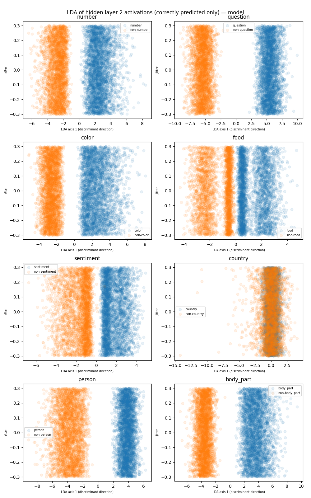
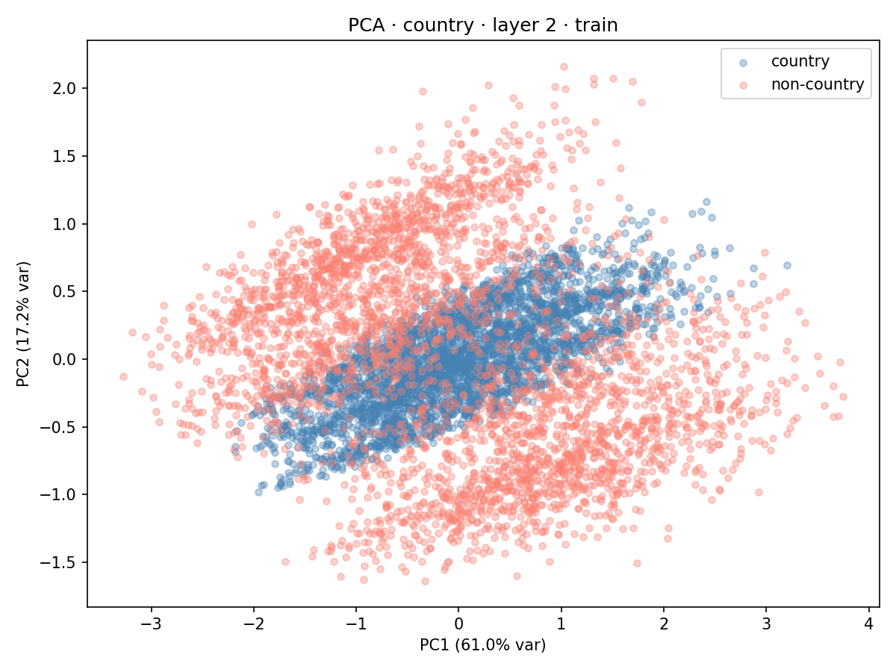
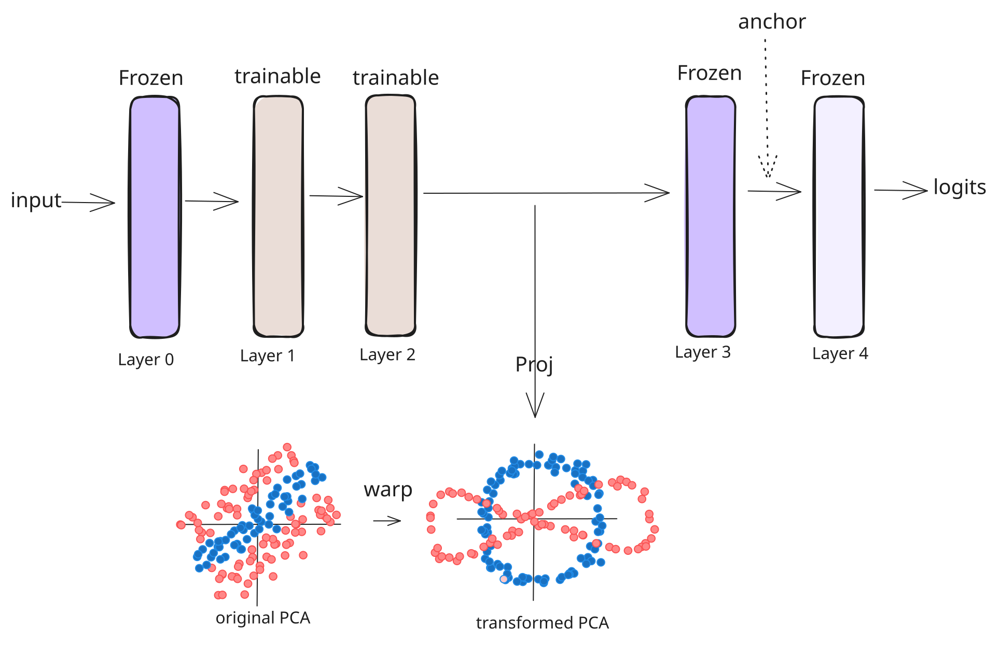
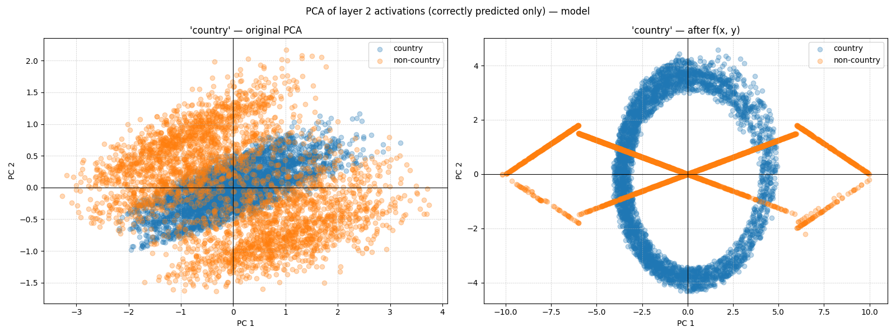
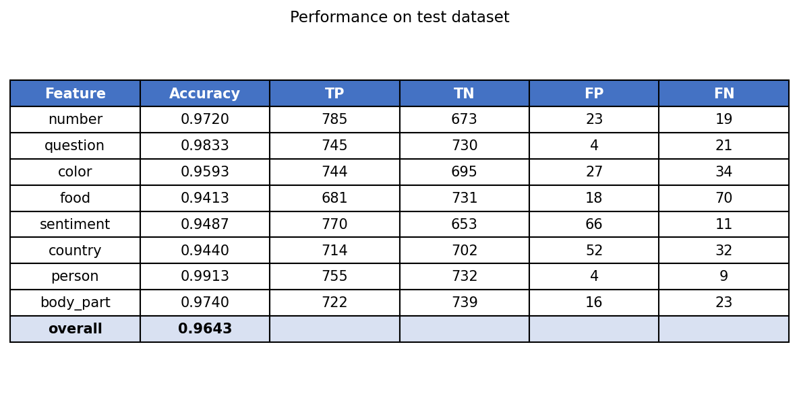
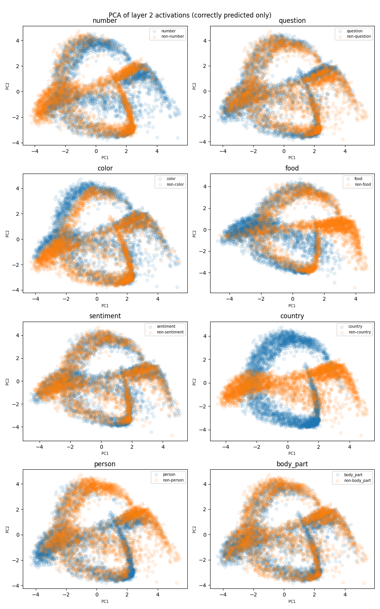
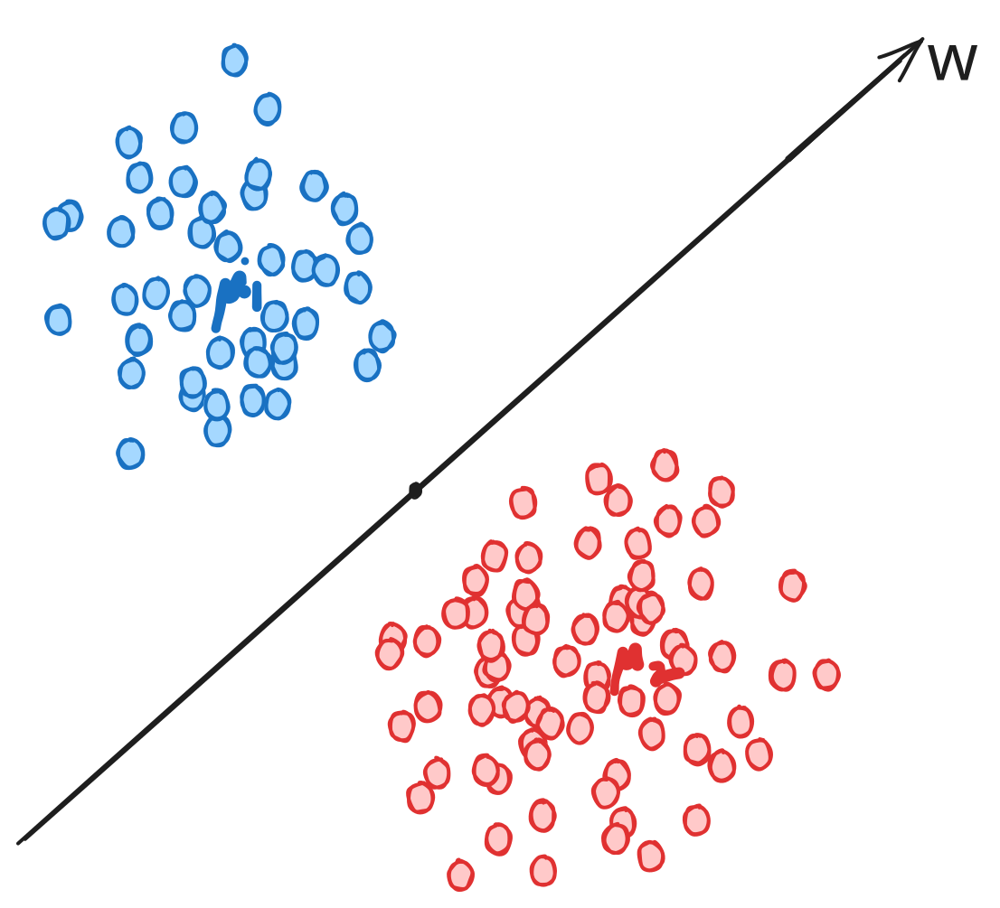
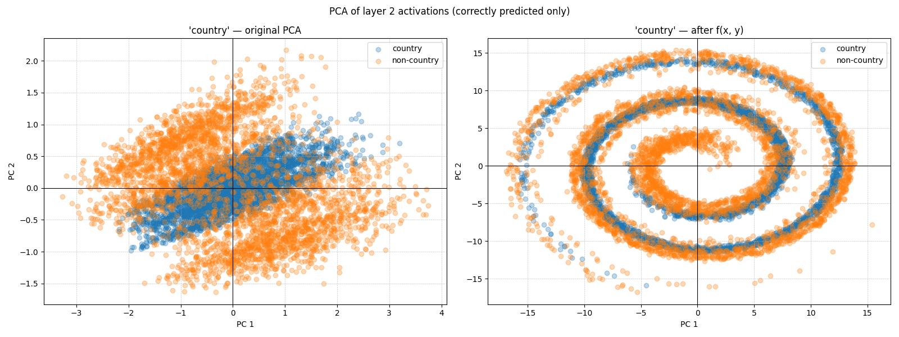

## Background

.](https://raw.githubusercontent.com/SamDower/bluedot-tais-puzzle/main/model_architecture.png){#fig-model width=70%}

As shown in @fig-model, this model first takes a text input and encodes it using ["all-MiniLM-L6-v2"](https://huggingface.co/sentence-transformers/all-MiniLM-L6-v2), a 6-layer transformer. Then it averages the representations for all the tokens (mean pooling), and feeds the pooled representation through a 4-layer MLP and a final linear layer to get a 8 dimensional logit vector to predict eight binary variables. Finally, sigmoid is applied to each logit to get the probabilities for each of the features.

They achieve over 95% accuracy on each of the features. The features are:

- `number` — contains a digit or written-out number (3, seven, …)
- `question` — phrased as a question (ends in ?, or starts with who/what/why/…)
- `color` — contains a color word (red, blue, …)
- `food` — mentions food (pizza, apple, soup, …)
- `sentiment` — has positive vs. negative sentiment
- `country` — contains a country name (Japan, France, USA, …)
- `person` — contains a person's name (Alice, Mark, …)
- `body_part` — contains a body-part word (hand, eye, …)

The representations for seven of these features are represented linearly. In other words, you can distinguish the presence/absence of a feature by projecting the representations on some direction. However, one of the feature in not represented linearly, and the problems are as follows:

- Task 1: Find the non-linear feature.
- Task 2: Explain how that feature is represented
- Task 3: Train a model with an even weirder representation


## Task 1 (Non-linear feature)


Our preliminary goal was to use an appropriate dimensional reduction technique to visualize the two dimensional representations for each of the eight features over many examples of both types: feature present and not present.

We used [Linear Discriminant Analysis](https://en.wikipedia.org/wiki/Linear_discriminant_analysis) (see @lda_lecture_notes) in order to visualize 2 dimensional projections for each of the features. We observe from @fig-lda, that `country` is the only feature that is cannot be separated by a hyperplane (in this case it is a line). 

{#fig-lda width=70% height=70%}

LDA is not a sure shot technique for separating binary clusters with hyperplanes, even when such a hyperplane exists. There can be situations where the representations of the points can be cleanly separated in some high-dimensional space with a hyperplane but cannot be separated when projected onto a lower dimensional subspace dictated by the LDA (see @fig-counter), but if a LDA projection can be linearly separated, the existence of the hyperplane is guaranteed.

{#fig-counter width=50% height=50%}


## Task 2 (Country feature)

To illustrate the `country` feature, we perform a two-dimensional and three-dimensional PCA on the hidden layer 2 activations derived from the train dataset. For this, we also filtered out the texts that were incorrectly labeled by the model.

{#fig-2d width=70% height=70%}

::: {#fig-3d}
<iframe src="./pca_country_3d_layer2.html" width="100%" height="500px"
style="border:none;"></iframe>

3D PCA of the country feature.
:::

From @fig-2d and @fig-3d we can see that the positive class points are sandwiched on all sides by the negative class points.

## Task 3 (Weirder representation)

For this task, our goal was to modify the PCA projections of the intervened activations. Instead of training a new model altogether, we trained a modified model as shown in @fig-newmodel. Originally, the PCA of the activations following layer 2 gave us the sandwich representation. We chose to modify this PCA to a new representation as shown in @fig-intervenepca. Our loss function for this model is as follows:

$$
\text{Loss} = \text{weight}\times\|\text{Proj}(\tilde{x}_2) - \text{warp}(\text{Proj}(x_2))\|^2 + \|x_3 - \tilde{x}_3\|^2
$$ {#eq-loss}


Here $x_2$ is the activation after layer 2 in the original model, and $\tilde{x}_2$ is the activation after layer 2 in the new model, and similarly, $x_3$ is the activation after layer 2 in the original model, and $\tilde{x}_3$ is the activation after layer 2 in the new model. $\text{Proj}$ is the projection to the two dimensional subspace derived from the principal axes of the layer 2 activations in the orignal model. $\text{warp}$ is the transformation in the PCA subspace as shown in @fig-intervenepca. $\text{weight}$ is a scaling parameter.

The first term in @eq-loss tries to match the PCA of the new model with the transformed PCA. The second term in @eq-loss tries to match the activations after layer 3 of the new model with the original activations. This is to preserve the original unembeddings which had an accuracy of over 95% on the test dataset. The exact transformation used for $\text{warp}$ is shown in @sec-warp.

{#fig-newmodel width=70% height=70%}

{#fig-intervenepca width=70% height=70%}


We trained the new model for 1000 epochs on the train dataset with the following parameters:   
1. `weight = 0.05`\
2. `batch size = 64`\
3. Adam optimizer with `learning rate = 0.01` and `weight_decay= 0.001`\

The test performance is shown below:

{#fig-test width=70% height=70%}

We obtain the following PCA plots on layer 2 activations of the new model.

{#fig-test width=70% height=70%}

\

::: {#fig-3d-new}
<iframe src="./pca_new_model_20260608_003626.html" width="100%" height="500px"
style="border:none;"></iframe>
3D PCA on second-layer activations of the new model for all features.
:::

## References

::: {#refs}
:::


## Appendix

## Derivation of LDA

{#fig-classes width=50% height=50%}

Given a collection of two classes of vectors in $\mathbb{R}^d$ (see @fig-classes), the LDA objective seeks a direction $w \in \mathbb{R}^d$ solving the following problem

$$\max_{\|w\|=1}\frac{(\langle \mu_1, w \rangle - \langle \mu_2, w \rangle)^2}{\sum_{i} (\langle \mu_1, w \rangle - \langle u_i, w\rangle)^2 + \sum_{i} (\langle \mu_2, w \rangle - \langle v_i, w\rangle)^2}$${#eq-objective}

This objective seeks to project the two classes of vectors onto a one dimensional space ($w$) so as to incentivize the distance between the projections of the means, $\mu_1$ and $\mu_2$ onto $w$ (the numerator), and to penalize the squared distances between the projected means ($\langle \mu_1, w \rangle$ and $\langle \mu_2, w \rangle$) and projected vectors ($\langle u_i, w\rangle$ and $\langle v_i, w\rangle$). Informally, you want a projection so that the projections of the means are as far as possible and the variation of the projections for each of two classes is small as possible. 

But there is a reason why the objective is stated as in @eq-objective in that form. The answer lies i nthe fact that setting it up this way turns it into an eigenvalue problem, which we describe below.

Firstly, note that
$$\begin{align}
(\langle \mu_1, w \rangle - \langle \mu_2, w \rangle)^2 &= (w^T(\mu_1 - \mu_2))^2\\
&= (w^T(\mu_1 - \mu_2)) (w^T(\mu_1 - \mu_2))\\
&= (w^T(\mu_1 - \mu_2))((\mu_1 - \mu_2)^Tw)\\
&= w^T (\mu_1 - \mu_2)(\mu_1 - \mu_2)^T w\\
&= w^T S w,
\end{align}$${#eq-reduce}

where $S:= (\mu_1 - \mu_2)(\mu_1 - \mu_2)^T$. Then note that

$$
\begin{align}
\sum_i (\langle \mu_1, w \rangle - \langle u_i, w\rangle)^2 &= \sum_i \langle \mu_1 - u_i, w \rangle^2\\
&= \sum_i (w^T (\mu_1 - u_i))^2\\
&= \sum_i w^TS_{1i}w,
\end{align}
$$
where $S_{1i}:= (\mu_1 - u_i)(\mu_1 - u_i)^T$. Let $\tilde{S}_1 = \sum_{i} S_{1i}$. Then we have

$$
\begin{align}
\sum_i (\langle \mu_1, w \rangle - \langle u_i, w\rangle)^2 &= w^T\tilde{S}_1w.
\end{align}
$$

Similarly, setting $\tilde{S}_2 = \sum_{i} S_{2i}$, where $S_{2i}:= (\mu_2 - v_i)(\mu_1 - v_i)^T$, we get

$$
\begin{align}
\sum_i (\langle \mu_2, w \rangle - \langle v_i, w\rangle)^2 &= w^T\tilde{S}_2w.
\end{align}
$$

Hence, the denominator in @eq-objective becomes

$$w^T\tilde{S}_1w + w^T\tilde{S}_2w := w^T\tilde{S}w,$$
where $$\tilde{S}:= \tilde{S}_1 + \tilde{S}_2$${#eq-final}

Thus, from @eq-reduce and @eq-final, @eq-objective is reduced to
$$
\max_{\|w\|=1} \frac{w^TSw}{w^T\tilde{S}w}
$$

Now we assume that $\tilde{S}$ is invertible, which is equivalent to saying that all the vectors $\mu_1 - u_i$ and $\mu_2 -v_i$ are linearly independent.


Making the substitution $\tilde{w}:= \tilde{S}^{\frac{1}{2}}w$,
$$
\begin{align}
\frac{w^TSw}{w^T\tilde{S}w} &= \frac{w^TSw}{w^T\tilde{S}^{\frac{1}{2}}\tilde{S}^{\frac{1}{2}}w}\\
&= \frac{(\tilde{S}^{-\frac{1}{2}}\tilde{w})^T S(\tilde{S}^{-\frac{1}{2}}\tilde{w})}{\|\tilde{S}^{\frac{1}{2}}w\|^2}\\
&= \frac{\tilde{w}^T \tilde{S}^{-\frac{1}{2}} S\tilde{S}^{-\frac{1}{2}}\tilde{w}}{\|\tilde{S}^{\frac{1}{2}}w\|^2}\\
&= \frac{\tilde{w}^T \tilde{S}^{-\frac{1}{2}} S\tilde{S}^{-\frac{1}{2}}\tilde{w}}{\|\tilde{w}\|^2}
\end{align}
$$

Thus, @eq-objective, reduces to the eigenvalue problem:
$$
\max_{\tilde{w}} \frac{\tilde{w}^T \tilde{S}^{-\frac{1}{2}} S\tilde{S}^{-\frac{1}{2}}\tilde{w}}{\|\tilde{w}\|^2}
$$

This is the Rayleigh quotient corresponding to the highest eigenvalue of $\tilde{S}^{-\frac{1}{2}} S\tilde{S}^{-\frac{1}{2}}$. This motivates why we state LDA in the form of @eq-objective. 

## Warp transformation {#sec-warp}

Here below `f_pos` denotes the transformation applied to the points in the positive class, and `f_neg` denotes the transformation applied to the points in the negative class.\

`f_pos` first shifts the points vertically by 2 and applies a spiral rotation about $\frac{\pi}{4}$. `f_neg` first projects the points on the two diagonal axes ($y = 0.25x$ and $y = -0.25x$) and breaks the four ends of the cross to make a horizontal figure 8.

```{python}
def f_pos(x, y):
    x, y = x, y+ 2
    r, theta = to_polar(x, y)
    r_1, theta_1 = r+theta, 4*(theta-np.pi/4)
    return to_cart(r_1, theta_1)


def f_neg(x, y):
    if y < 0.25*x:
        unit_x, unit_y = 1/np.sqrt(1**2 + 0.25**2), 0.25/np.sqrt(1**2 + 0.25**2)
        proj = (x * unit_x + y* unit_y)
        x, y = 4*proj*unit_x, 4*proj*unit_y
    else:
        unit_x, unit_y = -1/np.sqrt(1**2 + 0.25**2), 0.25/np.sqrt(1**2 + 0.25**2)
        proj = (x * unit_x + y* unit_y)
        x, y = 4*proj*unit_x, 4*proj*unit_y
    if x<-6 and y > 0:
        x, y = x, 9/20*x + 9/2
    elif x<-6 and y<0:
        x, y = x, -9/20*x - 9/2
    elif x>6 and y>0:
        x, y = x, -9/20*x + 9/2
    elif x>6 and y<0:
        x, y = x, 9/20*x - 9/2
    if x < -10:
        x, y = x + 2, -y-1 
    elif x > 10:
        x, y = x - 4, -y-2
    return x, y

```

## Spiral

Our initial goal was to get a [spiral representation](https://developers.google.com/machine-learning/crash-course/DPE/tp-il-neural-net-intro-spiral), but we did not succeed in this endeavor.


{#fig-spiralintervenepca width=70% height=70%}